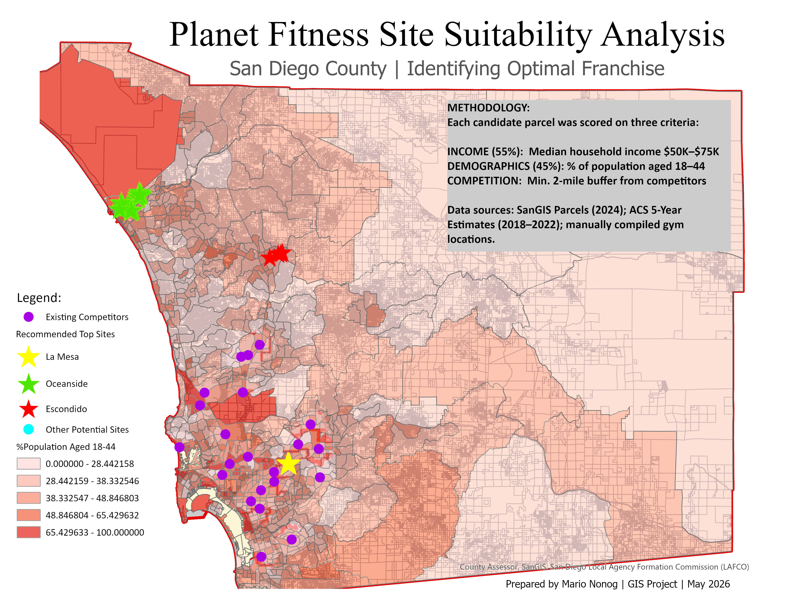
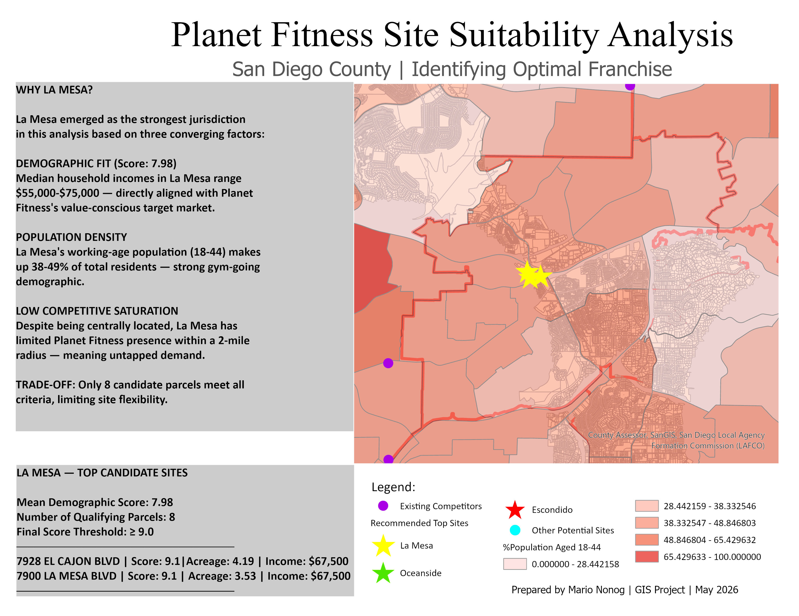
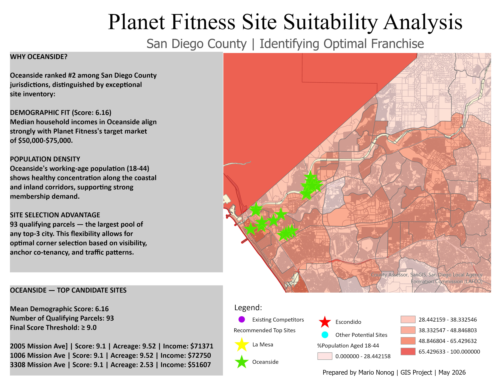
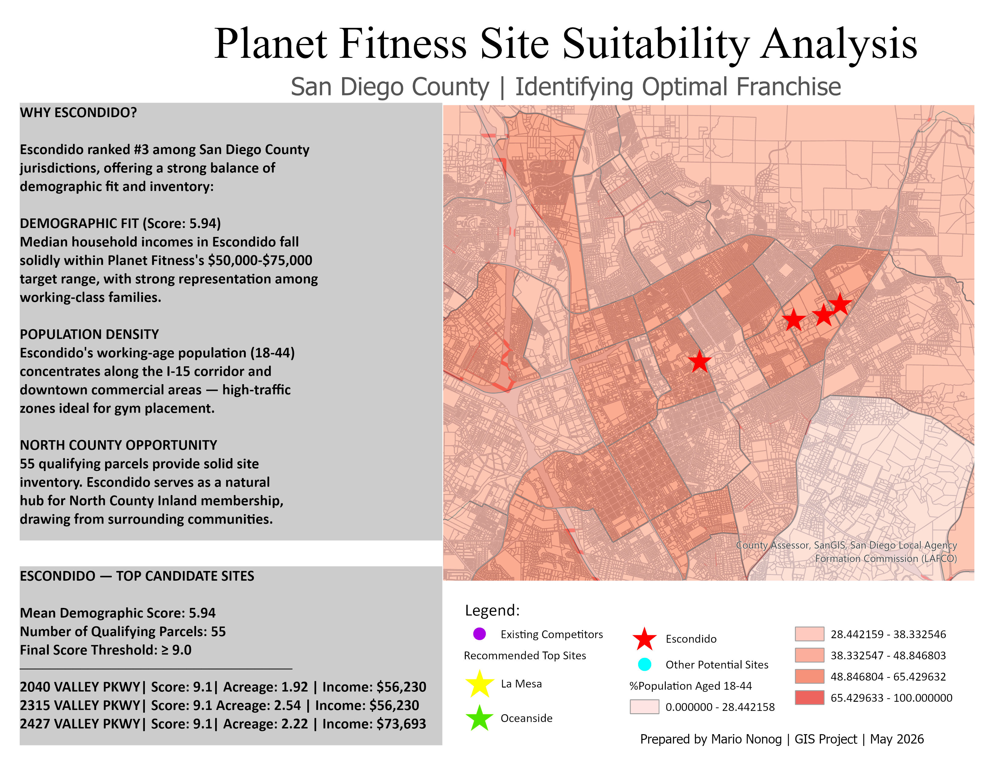

::: {.pf-hero}
GIS SITE SELECTION &nbsp;·&nbsp; SAN DIEGO COUNTY

### Where should Planet Fitness open its next franchise?

A demographic and competitive overlay analysis scoring every eligible parcel in San Diego County to identify the three most viable jurisdictions for a new location.

::: {.pf-stat-row}
::: {.pf-stat}
**1,054,840**
parcels countywide
:::
::: {.pf-stat}
**797**
candidate parcels evaluated
:::
::: {.pf-stat}
**28**
top recommended sites
:::
::: {.pf-stat}
**55 / 45**
income vs. demographic weighting
:::
:::
:::

## The question

Planet Fitness's franchise model depends on a precise customer fit: value-conscious members with household incomes between **$50K and $75K**, a working-age population (18–44) dense enough to fill memberships, and enough distance from existing gyms to avoid cannibalizing an existing location.

This analysis converts that open-ended business question into a measurable, defensible GIS workflow built on three pillars — **income fit, demographic fit, and competitive distance** — and produces a tiered jurisdiction ranking backed by parcel-level evidence.

## The data

Three authoritative datasets, integrated by geographic location.

::: {.pf-card-grid}
::: {.pf-source-card}
**SOURCE 01**

#### SanGIS Parcels
*2024*

Every taxable parcel in San Diego County, with assessor-coded land use, zoning, acreage, and address. Updated weekly.

**1.05M** total parcels countywide
:::
::: {.pf-source-card}
**SOURCE 02**

#### ACS Demographics
*2018–2022*

U.S. Census Bureau American Community Survey 5-Year Estimates at the Census tract level: median household income and population by age.

**736** census tracts in San Diego County
:::
::: {.pf-source-card}
**SOURCE 03**

#### Competitor Locations
*2026*

Existing Planet Fitness and 24 Hour Fitness storefronts, manually compiled from corporate websites and geocoded.

**30+** competitor sites mapped
:::
:::

## The process

Five sequential filters reduce a million parcels to a defensible shortlist.

::: {.pf-funnel}
::: {.pf-funnel-step}
**01 GATHER**
Load parcels, demographics, and competitor sites
:::
::: {.pf-funnel-step}
**02 EXCLUDE**
2-mile buffer around existing gyms removed
:::
::: {.pf-funnel-step}
**03 FILTER**
Keep commercial zoning + acreage ≥ 1.5 acres
:::
::: {.pf-funnel-step}
**04 ENRICH**
Spatial join with income + age tract data
:::
::: {.pf-funnel-step}
**05 SCORE**
Weighted index: income 55%, demographics 45%
:::
:::

::: {.pf-outcome}
**1,054,840 → 797 → 28** — from a million parcels to a shortlist of just 28 top recommended sites
:::

### Spatial filtering

Two spatial filters eliminated saturated zones and non-buildable land before scoring began.

::: {.pf-card-grid}
::: {.pf-source-card}
**FILTER 01 · COMPETITOR BUFFER**

Exclude parcels within 2 miles of any existing Planet Fitness or 24 Hour Fitness location. ArcGIS's Buffer tool created 2-mile rings around each competitor; the Erase tool then removed any parcel intersecting these rings, eliminating already-saturated trade areas.
:::
::: {.pf-source-card}
**FILTER 02 · LAND USE + SIZE**

Kept only buildable commercial parcels of adequate size, via a SQL filter on SanGIS attributes: `NUCLEUS_US IN (200, 213, 215, 216, 230, 240, 250, 251, 252, 340) AND ACREAGE >= 1.5 AND NUCLEUS_ZO IN (50, 60)` — vacant commercial, strip retail, shopping centers, and standalone retail.
:::
:::

::: {.pf-funnel-numbers}
1,054,840 starting universe → 778,615 after 2-mile buffer → 797 after commercial filter
:::

## Scoring each parcel

Two demographic dimensions, converted from raw data into comparable 1–10 scores, and combined into a single weighted index.

::: {.pf-card-grid}
::: {.pf-source-card}
**INCOME SCORE · WEIGHT 55%**

Median household income fit. Planet Fitness targets value-conscious customers, not luxury gym-goers — the scoring bracket peaks at $50K–$75K, the brand's documented core demographic.
:::
::: {.pf-source-card}
**POPULATION SCORE · WEIGHT 45%**

Working-age population concentration. Calculated for each tract as the percentage of population aged 18–44, summed from 16 ACS sex-and-age fields using a custom Arcade expression.
:::
:::

::: {.pf-formula}
Final Score = (Income Score × 0.55) + (Population Score × 0.45)
:::

Income is the slightly stronger predictor of Planet Fitness performance, since the brand's pricing model depends on a specific household-income band. Population density of the 18–44 demographic is a close second — without enough target-age residents nearby, even a perfect income match will struggle to fill memberships.

## The rankings

Mean final score across all candidate parcels, by jurisdiction.

| Rank | Jurisdiction | Mean score | Candidate parcels |
|:----:|:---|:----:|:----:|
| 1 | **La Mesa** | **7.98** | 8 |
| 2 | **Oceanside** | **6.16** | 93 |
| 3 | **Escondido** | **5.94** | 55 |
| 4 | Imperial Beach | 5.55 | 2 |
| 5 | San Marcos | 5.36 | 60 |
| 6 | National City | 5.29 | 17 |
| 7 | Vista | 5.16 | 45 |
| 8 | San Diego | 5.08 | 113 |
| 9 | Chula Vista | 4.98 | 52 |
| 10 | El Cajon | 4.71 | 5 |

## The maps

::: panel-tabset
### Countywide

### #1 La Mesa

**Why La Mesa?** La Mesa emerged as the strongest jurisdiction based on three converging factors: median household incomes of $55,000–$75,000 directly aligned with Planet Fitness's target market (demographic fit score 7.98); a working-age population making up 38–49% of residents; and, despite its central location, limited existing Planet Fitness presence within a 2-mile radius. The trade-off: only 8 candidate parcels meet all criteria, limiting site flexibility.

**Top candidate sites:** 7928 El Cajon Blvd (score 9.1, 4.19 acres, $67,500 income) · 7900 La Mesa Blvd (score 9.1, 3.53 acres, $67,500 income)

### #2 Oceanside

**Why Oceanside?** Oceanside ranked #2, distinguished by an exceptional site inventory: median household incomes aligned strongly with the $50,000–$75,000 target (demographic fit score 6.16), healthy working-age population concentration along the coastal and inland corridors, and 93 qualifying parcels — the largest pool of any top-3 city, allowing flexibility for optimal corner selection based on visibility, anchor co-tenancy, and traffic patterns.

**Top candidate sites:** 2005 Mission Ave (score 9.1, 9.52 acres, $71,371 income) · 1006 Mission Ave (score 9.1, 9.52 acres, $72,750 income) · 3308 Mission Ave (score 9.1, 2.53 acres, $51,607 income)

### #3 Escondido

**Why Escondido?** Escondido ranked #3, offering a strong balance of demographic fit and inventory: incomes falling solidly within the $50,000–$75,000 target range with strong representation among working-class families (score 5.94), a working-age population concentrated along the I-15 corridor and downtown — high-traffic zones ideal for gym placement — and 55 qualifying parcels serving as a natural hub for North County Inland membership.

**Top candidate sites:** 2040 Valley Pkwy (score 9.1, 1.92 acres, $56,230 income) · 2315 Valley Pkwy (score 9.1, 2.54 acres, $56,230 income) · 2427 Valley Pkwy (score 9.1, 2.22 acres, $73,693 income)
:::

## Key insights & limitations

::: {.pf-card-grid}
::: {.pf-insight-card}
#### Insights

- **Demographics matter more than density.** Coastal areas (Del Mar, Solana Beach, Encinitas) ranked lowest despite high population — incomes far above Planet Fitness's target band.
- **The single best site is in National City.** 0 Bay Marina Dr scored a perfect 10.0, but with only 17 candidate parcels citywide, National City didn't crack the top 3 by mean score.
- **Valley Parkway is a hot corridor.** Four of the top 28 sites cluster along Valley Pkwy in Escondido, suggesting strong demographic alignment along that commercial strip.
- **Inventory matters as much as mean score.** La Mesa scored highest but offers only 8 sites; Oceanside's 93 sites give a franchise team far more room to negotiate.
:::
::: {.pf-insight-card}
#### Limitations

- **Two dimensions, not all dimensions.** Foot traffic, parking, visibility from major roads, anchor co-tenancy, and lease availability aren't captured — all matter to real franchise decisions.
- **Tract-level demographics smooth out neighborhoods.** A single Census tract may contain very different micro-neighborhoods; block-group data would be sharper for site-level decisions.
- **Land-use codes lag reality.** SanGIS warns its land-use field updates irregularly — a parcel listed "vacant commercial" may have a new tenant, so ground-truthing is essential.
- **Buffer assumption.** The 2-mile competitor radius fits urban San Diego but is conservative for North County; a variable buffer would refine results.
:::
:::

## Recommendations

::: {.pf-funnel}
::: {.pf-funnel-step}
**01 GROUND-TRUTH THE TOP 10**
Visit highest-scoring parcels in person to check visibility, parking, anchor co-tenancy, and adjacent retail mix that GIS can't capture.
:::
::: {.pf-funnel-step}
**02 ADD A THIRD DIMENSION**
Drive-time analysis using ArcGIS Network Analyst — a site with strong demographics but poor accessibility won't perform.
:::
::: {.pf-funnel-step}
**03 REFINE WITH BLOCK-GROUP DATA**
Re-run the demographic overlay at the Census block-group level for sharper neighborhood-scale precision in dense areas.
:::
::: {.pf-funnel-step}
**04 VARIABLE COMPETITOR BUFFERS**
Tighter buffers (1.5 mi) in dense urban zones, wider buffers (4–5 mi) in North County to reflect real trade-area geometry.
:::
:::

::: {.pf-downloads}
[Download the full presentation (PDF)](other_docs/PlanetFitness_SiteSelection_Presentation.pdf){.pf-download-btn target="_blank"} [Download the original slides (.pptx)](other_docs/PlanetFitness_SiteSelection_Presentation.pptx){.pf-download-btn .pf-download-btn-outline}
:::

Data sources: SanGIS Parcels (2024) · ACS 5-Year Estimates (2018–2022) · manually compiled competitor locations. Prepared by Mario Nonog, GIS Project, May 2026.

